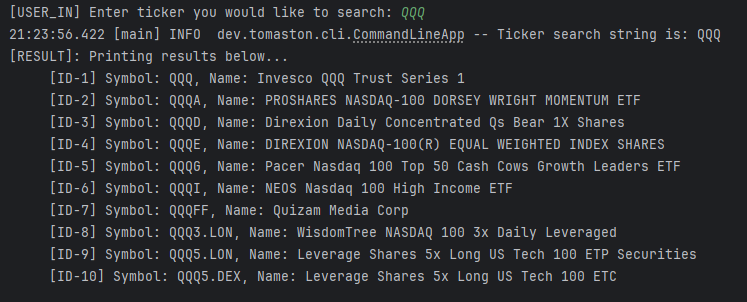

[![Contributors][contributors-shield]][contributors-url]
[![Forks][forks-shield]][forks-url]
[![Stargazers][stars-shield]][stars-url]
[![Issues][issues-shield]][issues-url]
[![MIT License][license-shield]][license-url]
[![LinkedIn][linkedin-shield]][linkedin-url]

# Alpha Vantage CLI

A small command line interface to search for Exchange Traded Funds (ETFs) from the Alpha Vantage API based on a ticker search string.
Example below: 




## 🧑‍💻 Tech Stack

![Java]

## 🔧 Setup

### Dependencies
All maven dependencies can be located in ```pom.xml```

### Alpha Vantage API Key
A free-tier Alpha Vantage API key can be obtained from https://www.alphavantage.co

Add your API key to your ```apiKey.properties``` file:  ```alphaVantageApiKey=[yourApiKey]```

## 🧑‍🤝‍🧑 Developers 

| Name           | Email                      |
| -------------- | -------------------------- |
| Tom Aston      | mailto:mail@tomaston.dev     |

<!-- MARKDOWN LINKS & IMAGES -->
<!-- https://www.markdownguide.org/basic-syntax/#reference-style-links -->
[contributors-shield]: https://img.shields.io/github/contributors/TomAston1996/alpha-vantage-cli.svg?style=for-the-badge
[contributors-url]: https://github.com/TomAston1996/alpha-vantage-cli/graphs/contributors
[forks-shield]: https://img.shields.io/github/forks/TomAston1996/alpha-vantage-cli.svg?style=for-the-badge
[forks-url]: https://github.com/TomAston1996/alpha-vantage-cli/network/members
[stars-shield]: https://img.shields.io/github/stars/TomAston1996/alpha-vantage-cli.svg?style=for-the-badge
[stars-url]: https://github.com/TomAston1996/alpha-vantage-cli/stargazers
[issues-shield]: https://img.shields.io/github/issues/TomAston1996/alpha-vantage-cli.svg?style=for-the-badge
[issues-url]: https://github.com/TomAston1996/alpha-vantage-cli/issues
[license-shield]: https://img.shields.io/github/license/TomAston1996/alpha-vantage-cli.svg?style=for-the-badge
[license-url]: https://github.com/TomAston1996/alpha-vantage-cli/blob/master/LICENSE.txt
[linkedin-shield]: https://img.shields.io/badge/-LinkedIn-black.svg?style=for-the-badge&logo=linkedin&colorB=555
[linkedin-url]: https://linkedin.com/in/tomaston96
[Java]: https://img.shields.io/badge/java-%23ED8B00.svg?style=for-the-badge&logo=openjdk&logoColor=white
[Spring]: https://img.shields.io/badge/spring-%236DB33F.svg?style=for-the-badge&logo=spring&logoColor=white
[Postgres]: https://img.shields.io/badge/postgres-%23316192.svg?style=for-the-badge&logo=postgresql&logoColor=white
[Docker]: https://img.shields.io/badge/docker-%230db7ed.svg?style=for-the-badge&logo=docker&logoColor=white
